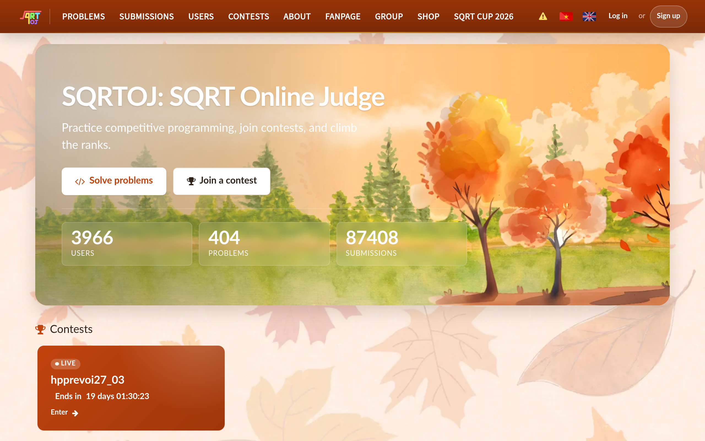

# sqrtoj Design System

You are building UI for **sqrtoj**. Dark-themed, warm palette, monospace typography (Latin Modern Math), compact density on a 4px grid, expressive motion.

## Visual Reference

**IMPORTANT**: Study ALL screenshots below before writing any UI. Match colors, typography, spacing, layout, and motion exactly as shown.

### Homepage



> Read `references/DESIGN.md` for full token details.

## Design Philosophy

- **Layered depth** — use shadow tokens to create a sense of physical layering. Each elevation level has a specific shadow.
- **Gradient accents** — gradients are used thoughtfully for emphasis, not decoration.
- **Single typeface** — Latin Modern Math carries all text. Hierarchy comes from size, weight, and color — never font mixing.
- **compact density** — 4px base grid. Every dimension is a multiple of 4.
- **warm palette** — the color temperature runs warm, matching the monospace typography.
- **Restrained accent** — `#c1440e` is the only pop of color. Used exclusively for CTAs, links, focus rings, and active states.
- **Expressive motion** — animations are an integral part of the experience. Use spring physics and layout animations.

## Color System

### Core Palette

| Role | Token | Hex | Use |
|------|-------|-----|-----|
| Background | `--background` | `#231f20` | Page/app background |
| Surface | `--surface` | `#ffffff` | Cards, panels, modals |
| Text Primary | `--text-primary` | `#e4d5c1` | Headings, body text |
| Text Muted | `--text-muted` | `#6e5d4e` | Captions, placeholders |
| Accent | `--accent` | `#c1440e` | CTAs, links, focus rings |

### Status Colors

| Status | Hex | Use |
|--------|-----|-----|
| Warning | `#fbf6ef` | Caution states, pending items |
| Danger | `#7a2906` | Errors, destructive actions |

### Extended Palette

- `#0000ff`
- `#03a89e`
- `#aa00aa`
- `#d01040` — Warm accent — hover glow or decorative highlight
- `#888888`
- `#009999`
- `#008080`

### CSS Variable Tokens

```css
--color-border: #e4d5c1;
--color-border-strong: #d3bfa4;
--color-text-secondary: #6e5d4e;
--color-text-muted: #8a7360;
--color-accent: #c1440e;
--color-accent-hover: #9e3609;
--color-accent-contrast: #ffffff;
--color-accent-2: #e0a82e;
--card-pad: 24px;
--footer-accent: var(--color-accent);
--footer-accent-hover: var(--color-accent-hover);
--color-border: #e4d5c1;
--color-border-strong: #d3bfa4;
--color-text-secondary: #6e5d4e;
--color-text-muted: #8a7360;
--color-accent: #c1440e;
--color-accent-hover: #9e3609;
--color-accent-contrast: #ffffff;
--color-accent-2: #e0a82e;
--card-pad: 24px;
```

## Typography

### Font Stack

- **Latin Modern Math** — Heading 1, Heading 2, Heading 3
- **JetBrains Mono** — Body, Caption, Code

### Font Sources

```css
@font-face {
  font-family: "JetBrains Mono";
  src: url("fonts/JetBrainsMono-Bold.ttf") format("truetype");
  font-weight: 700;
}
@font-face {
  font-family: "JetBrains Mono";
  src: url("fonts/JetBrainsMono-Regular.ttf") format("truetype");
  font-weight: 400;
}
@font-face {
  font-family: "Latin Modern Math";
  src: url("fonts/LatinModernMath-Regular.woff2") format("woff2");
  font-weight: 400;
}
@font-face {
  font-family: "Source Sans Pro";
  src: url("fonts/SourceSansPro-Regular.woff2") format("woff2");
  font-weight: 400;
}
@font-face {
  font-family: "Lato";
  src: url("fonts/Lato-Bold.ttf") format("truetype");
  font-weight: 700;
}
@font-face {
  font-family: "Lato";
  src: url("fonts/Lato-Regular.ttf") format("truetype");
  font-weight: 400;
}
```

### Type Scale

| Role | Family | Size | Weight |
|------|--------|------|--------|
| Heading 1 | Latin Modern Math | clamp(2rem,12vw,3.5rem) | 700 |
| Heading 2 | Latin Modern Math | var(--text-2xl,30px) | 700 |
| Heading 3 | Latin Modern Math | clamp(1.65rem,9vw,2rem) | 700 |
| Body | JetBrains Mono | 15px | 400 |
| Caption | JetBrains Mono | 12px | 400 |
| Code | JetBrains Mono | 14px | 400 |

### Typography Rules

- All text uses **Latin Modern Math** — never add another font family
- Max 3-4 font sizes per screen
- Headings: weight 600-700, body: weight 400
- Use color and opacity for text hierarchy, not additional font sizes
- Line height: 1.5 for body, 1.2 for headings

## Spacing & Layout

### Base Grid: 4px

Every dimension (margin, padding, gap, width, height) must be a multiple of **4px**.

### Spacing Scale

`2, 4, 6, 8, 10, 12, 14, 16, 18, 20, 22, 24` px

### Spacing as Meaning

| Spacing | Use |
|---------|-----|
| 4-8px | Tight: related items (icon + label, avatar + name) |
| 12-16px | Medium: between groups within a section |
| 24-32px | Wide: between distinct sections |
| 48px+ | Vast: major page section breaks |

### Border Radius

Scale: `.1em, 0.15em, 0.2em, 2px, 3px, 4px, 5px, 6px, 7px, 8px, 8px 8px 0px 0px, 10px, 12px 12px 0px 0px, 12px, 20%, 999px`
Default: `7px`

### Container

Max-width: `1024px`, centered with auto margins.

### Breakpoints

| Name | Value |
|------|-------|
| xs | 380px |
| xs | 420px |
| xs | 480px |
| sm | 600px |
| md | 699px |
| md | 700px |
| md | 760px |
| lg | 799px |
| lg | 800px |
| lg | 860px |
| lg | 960px |
| lg | 961px |
| lg | 1000px |
| lg | 1024px |
| 2xl | 1498px |

Mobile-first: design for small screens, layer on responsive overrides.

## Component Patterns

### Card

```css
.card {
  background: #ffffff;
  border-radius: 7px;
  padding: 16px;
  box-shadow: var(--shadow-2);
}
```

```html
<div class="card">
  <h3>Card Title</h3>
  <p>Card content goes here.</p>
</div>
```

### Button

```css
/* Primary */
.btn-primary {
  background: #c1440e;
  color: #e4d5c1;
  border-radius: 7px;
  padding: 8px 16px;
  font-weight: 500;
  transition: opacity 150ms ease;
}
.btn-primary:hover { opacity: 0.9; }

/* Ghost */
.btn-ghost {
  background: transparent;
  border: 1px solid #444444;
  color: #e4d5c1;
  border-radius: 7px;
  padding: 8px 16px;
}
```

```html
<button class="btn-primary">Get Started</button>
<button class="btn-ghost">Learn More</button>
```

### Input

```css
.input {
  background: #231f20;
  border: 1px solid #444444;
  border-radius: 7px;
  padding: 8px 12px;
  color: #e4d5c1;
  font-size: 14px;
}
.input:focus { border-color: #c1440e; outline: none; }
```

```html
<input class="input" type="text" placeholder="Search..." />
```

### Badge / Chip

```css
.badge {
  display: inline-flex;
  align-items: center;
  padding: 4px 8px;
  border-radius: 9999px;
  font-size: 12px;
  font-weight: 500;
  background: #ffffff;
  color: #6e5d4e;
}
```

```html
<span class="badge">New</span>
<span class="badge">Beta</span>
```

### Modal / Dialog

```css
.modal-backdrop { background: rgba(0, 0, 0, 0.6); }
.modal {
  background: #ffffff;
  border-radius: 999px;
  padding: 24px;
  max-width: 480px;
  width: 90vw;
  box-shadow: var(--shadow-2),0 4px 14px var(--color-focus-ring-soft);
}
```

```html
<div class="modal-backdrop">
  <div class="modal">
    <h2>Dialog Title</h2>
    <p>Dialog content.</p>
    <button class="btn-primary">Confirm</button>
    <button class="btn-ghost">Cancel</button>
  </div>
</div>
```

### Table

```css
.table { width: 100%; border-collapse: collapse; }
.table th {
  text-align: left;
  padding: 8px 12px;
  font-weight: 500;
  font-size: 12px;
  color: #6e5d4e;
  text-transform: uppercase;
  letter-spacing: 0.05em;
  border-bottom: 1px solid #444444;
}
.table td {
  padding: 12px;
  border-bottom: 1px solid #444444;
}
```

```html
<table class="table">
  <thead><tr><th>Name</th><th>Status</th><th>Date</th></tr></thead>
  <tbody>
    <tr><td>Item One</td><td>Active</td><td>Jan 1</td></tr>
    <tr><td>Item Two</td><td>Pending</td><td>Jan 2</td></tr>
  </tbody>
</table>
```

### Navigation

```css
.nav {
  display: flex;
  align-items: center;
  gap: 8px;
  padding: 12px 16px;
}
.nav-link {
  color: #6e5d4e;
  padding: 8px 12px;
  border-radius: 7px;
  transition: color 150ms;
}
.nav-link:hover { color: #e4d5c1; }
.nav-link.active { color: #c1440e; }
```

```html
<nav class="nav">
  <a href="/" class="nav-link active">Home</a>
  <a href="/about" class="nav-link">About</a>
  <a href="/pricing" class="nav-link">Pricing</a>
  <button class="btn-primary" style="margin-left: auto">Get Started</button>
</nav>
```

### Extracted Components

These components were found in the codebase:

**Button** (`html`)

**Card** (`html`)
- Variants: `-live`

## Page Structure

The following page sections were detected:

- **Navigation** — Top navigation bar (20 items)
- **Hero** — Hero/banner section with headline and CTAs
- **Footer** — Page footer with links and info (14 items)
- **Cta** — Call-to-action section

When building pages, follow this section order and structure.

## Animation & Motion

This project uses **expressive motion**. Animations are part of the design language.

### CSS Animations

- `spotlight-pulse`
- `hero-drift-1`
- `hero-drift-2`
- `hero-drift-3`
- `ui-fade-up`

### Motion Tokens

- **Duration scale:** `0ms`, `0.01ms`, `0.2s`, `100ms`, `120ms`, `150ms`, `200ms`, `300ms`, `400ms`, `450ms`, `100000000ms`
- **Easing functions:** `ease`, `linear`, `ease-in-out`
- **Animated properties:** `color`

### Motion Guidelines

- **Duration:** Use values from the duration scale above. Short (0ms) for micro-interactions, long (100000000ms) for page transitions
- **Easing:** Use `ease` as the default easing curve
- **Direction:** Elements enter from bottom/right, exit to top/left
- **Reduced motion:** Always respect `prefers-reduced-motion` — disable animations when set

## Depth & Elevation

### Shadow Tokens

- Subtle: `inset 0-2px 0 var(--color-accent)`
- Subtle: `rgba(74, 45, 24, 0.1) 0px 1px 2px 0px`
- Subtle: `rgb(193, 68, 14) 0px -2px 0px 0px inset`
- Raised (cards, buttons): `var(--shadow-2)`
- Raised (cards, buttons): `var(--shadow-3)`
- Raised (cards, buttons): `inset 3px 0 0 var(--color-accent)`

### Z-Index Scale

`0, 1, 2, 3, 5, 99, 100, 1000, 1051, 1100, 9999, 100000, 1000000, 1000001`

Use these exact values — never invent z-index values.

## Anti-Patterns (Never Do)

- **No blur effects** — no backdrop-blur, no filter: blur()
- **No zebra striping** — tables and lists use borders for separation
- **No invented colors** — every hex value must come from the palette above
- **No arbitrary spacing** — every dimension is a multiple of 4px
- **No extra fonts** — only Latin Modern Math and JetBrains Mono are allowed
- **No arbitrary border-radius** — use the scale: .1em, 0.15em, 0.2em, 2px, 3px, 4px, 5px, 6px, 7px, 8px
- **No opacity for disabled states** — use muted colors instead

## Workflow

1. **Read** `references/DESIGN.md` before writing any UI code
2. **Pick colors** from the Color System section — never invent new ones
3. **Set typography** — Latin Modern Math, JetBrains Mono only, using the type scale
4. **Build layout** on the 4px grid — check every margin, padding, gap
5. **Match components** to patterns above before creating new ones
6. **Apply elevation** — use shadow tokens
7. **Validate** — every value traces back to a design token. No magic numbers.

## Brand Spec

- **Favicon:** `/apple-touch-icon-57x57.png`
- **Site URL:** `https://sqrtoj.edu.vn`
- **Brand color:** `#c1440e`
- **Brand typeface:** Latin Modern Math

## Quick Reference

```
Background:     #231f20
Surface:        #ffffff
Text:           #e4d5c1 / #6e5d4e
Accent:         #c1440e
Border:         (not extracted)
Font:           Latin Modern Math
Spacing:        4px grid
Radius:         7px
Components:     10 detected
```

## When to Trigger

Activate this skill when:
- Creating new components, pages, or visual elements for sqrtoj
- Writing CSS, Tailwind classes, styled-components, or inline styles
- Building page layouts, templates, or responsive designs
- Reviewing UI code for design consistency
- The user mentions "sqrtoj" design, style, UI, or theme
- Generating mockups, wireframes, or visual prototypes

---

# Full Reference Files

> Every output file is embedded below. Claude has full design system context from /skills alone.

## Design System Tokens (DESIGN.md)

# sqrtoj DESIGN.md

> Auto-generated design system — reverse-engineered via static analysis by skillui.
> Frameworks: None detected
> Colors: 20 · Fonts: 2 · Components: 10
> Icon library: not detected · State: not detected
> Primary theme: dark · Dark mode toggle: no · Motion: expressive

## Visual Reference

**Match this design exactly** — study colors, fonts, spacing, and component shapes before writing any UI code.


---

## 1. Visual Theme & Atmosphere

This is a **dark-themed** interface with a warm tone. Depth is expressed through layered shadows and subtle surface color variation. Typography uses **Latin Modern Math** throughout — a technical, developer-focused choice that maintains consistency. Spacing follows a **4px base grid** (compact density), with scale: 2, 4, 6, 8, 10, 12, 14, 16px. The accent color **#c1440e** anchors interactive elements (buttons, links, focus rings). Motion is expressive — spring physics, layout animations, and staggered reveals are part of the visual language.

---

## 2. Color Palette & Roles

| Token | Hex | Role | Use |
|---|---|---|---|
| theme-color | `#231f20` | background | Page background, darkest surface |
| color-surface | `#ffffff` | surface | Card and panel backgrounds |
| surface | `#000000` | surface | Card and panel backgrounds |
| color-surface-alt | `#f4ebdd` | surface | Card and panel backgrounds |
| color-border | `#e4d5c1` | text-primary | Headings and body text |
| color-text-secondary | `#6e5d4e` | text-muted | Captions, placeholders, secondary info |
| color-text-muted | `#8a7360` | text-muted | Captions, placeholders, secondary info |
| text-muted | `#999999` | text-muted | Captions, placeholders, secondary info |
| color-accent | `#c1440e` | accent | CTAs, links, focus rings, active states |
| accent | `#ff0066` | accent | CTAs, links, focus rings, active states |
| color-accent-hover | `#9e3609` | accent | CTAs, links, focus rings, active states |
| color-navbar-gradient-end | `#7a2906` | danger | Error states, destructive actions |
| color-canvas | `#fbf6ef` | warning | Warning states, caution indicators |
| info | `#0000ff` | info | Informational highlights |
| unknown | `#03a89e` | unknown | Palette color |
| unknown | `#aa00aa` | unknown | Palette color |
| unknown | `#d01040` | unknown | Palette color |
| unknown | `#888888` | unknown | Palette color |
| unknown | `#009999` | unknown | Palette color |
| unknown | `#008080` | unknown | Palette color |

### CSS Variable Tokens

```css
--color-border: #e4d5c1;
--color-border-strong: #d3bfa4;
--color-text-secondary: #6e5d4e;
--color-text-muted: #8a7360;
--color-accent: #c1440e;
--color-accent-hover: #9e3609;
--color-accent-contrast: #ffffff;
--color-accent-2: #e0a82e;
--card-pad: 24px;
--footer-accent: var(--color-accent);
--footer-accent-hover: var(--color-accent-hover);
--color-border: #e4d5c1;
--color-border-strong: #d3bfa4;
--color-text-secondary: #6e5d4e;
--color-text-muted: #8a7360;
--color-accent: #c1440e;
--color-accent-hover: #9e3609;
--color-accent-contrast: #ffffff;
--color-accent-2: #e0a82e;
--card-pad: 24px;
```


---

## 3. Typography Rules

**Font Stack:**
- **Latin Modern Math** — Heading 1, Heading 2, Heading 3
- **JetBrains Mono** — Body, Caption, Code

**Font Sources:**

```css
@font-face {
  font-family: "JetBrains Mono";
  src: url("fonts/JetBrainsMono-Bold.ttf") format("truetype");
  font-weight: 700;
}
@font-face {
  font-family: "JetBrains Mono";
  src: url("fonts/JetBrainsMono-Regular.ttf") format("truetype");
  font-weight: 400;
}
@font-face {
  font-family: "Latin Modern Math";
  src: url("fonts/LatinModernMath-Regular.woff2") format("woff2");
  font-weight: 400;
}
@font-face {
  font-family: "Source Sans Pro";
  src: url("fonts/SourceSansPro-Regular.woff2") format("woff2");
  font-weight: 400;
}
@font-face {
  font-family: "Lato";
  src: url("fonts/Lato-Bold.ttf") format("truetype");
  font-weight: 700;
}
@font-face {
  font-family: "Lato";
  src: url("fonts/Lato-Regular.ttf") format("truetype");
  font-weight: 400;
}
```

| Role | Font | Size | Weight |
|---|---|---|---|
| Heading 1 | Latin Modern Math | clamp(2rem,12vw,3.5rem) | 700 |
| Heading 2 | Latin Modern Math | var(--text-2xl,30px) | 700 |
| Heading 3 | Latin Modern Math | clamp(1.65rem,9vw,2rem) | 700 |
| Body | JetBrains Mono | 15px | 400 |
| Caption | JetBrains Mono | 12px | 400 |
| Code | JetBrains Mono | 14px | 400 |

**Typographic Rules:**
- Use **Latin Modern Math** for all text — do not mix font families
- Maintain consistent hierarchy: no more than 3-4 font sizes per screen
- Headings use bold (600-700), body uses regular (400)
- Line height: 1.5 for body text, 1.2 for headings
- Use color and opacity for secondary hierarchy, not additional font sizes


---

## 4. Component Stylings

### Layout (1)

**Footer** — `html`

### Navigation (1)

**Navigation** — `html`

### Data Display (3)

**Card** — `html`
- Variants: `-live`

**Badge** — `html`

**List** — `html`

### Data Input (2)

**Button** — `html`
- Animation: 

**Input** — `html`
- State: :focus, :placeholder

### Media (3)

**Image** — `html`

**Icon** — `html`

**Map/Canvas** — `html`


---

## 5. Layout Principles

- **Base spacing unit:** 4px
- **Spacing scale:** 2, 4, 6, 8, 10, 12, 14, 16, 18, 20, 22, 24
- **Border radius:** .1em, 0.15em, 0.2em, 2px, 3px, 4px, 5px, 6px, 7px, 8px, 8px 8px 0px 0px, 10px, 12px 12px 0px 0px, 12px, 20%, 999px
- **Max content width:** 1024px

**Spacing as Meaning:**
| Spacing | Use |
|---|---|
| 4-8px | Tight: related items within a group |
| 12-16px | Medium: between groups |
| 24-32px | Wide: between sections |
| 48px+ | Vast: major section breaks |


---

## 6. Depth & Elevation

### Flat — subtle depth hints

- `inset 0-2px 0 var(--color-accent)`
- `rgba(74, 45, 24, 0.1) 0px 1px 2px 0px`
- `rgb(193, 68, 14) 0px -2px 0px 0px inset`

### Raised — cards, buttons, interactive elements

- `var(--shadow-2)`
- `var(--shadow-3)`
- `inset 3px 0 0 var(--color-accent)`

### Floating — dropdowns, popovers, modals

- `var(--shadow-2),0 4px 14px var(--color-focus-ring-soft)`
- `rgba(74, 45, 24, 0.12) 0px 4px 12px 0px`

### Overlay — full-screen overlays, top-level dialogs

- `0 8px 24px rgba(0,0,0,0.18)`
- `0 0 0 1000px var(--color-surface) inset`

### Z-Index Scale

`0, 1, 2, 3, 5, 99, 100, 1000, 1051, 1100, 9999, 100000, 1000000, 1000001`


---

## 7. Animation & Motion

This project uses **expressive motion**. Animations are an integral part of the experience.

### CSS Animations

- `@keyframes spotlight-pulse`
- `@keyframes hero-drift-1`
- `@keyframes hero-drift-2`
- `@keyframes hero-drift-3`
- `@keyframes ui-fade-up`
- `@keyframes fa-spin`

### Animated Components

- **Button**: 

### Motion Guidelines

- Duration: 150-300ms for micro-interactions, 300-500ms for page transitions
- Easing: `ease-out` for enters, `ease-in` for exits
- Always respect `prefers-reduced-motion`


---

## 8. Do's and Don'ts

### Do's

- Use `#c1440e` for interactive elements (buttons, links, focus rings)
- Use `#231f20` as the primary page background
- Use **Latin Modern Math** for all UI text
- Follow the **4px** spacing grid for all margins, padding, and gaps
- Use the defined shadow tokens for elevation — see Section 6
- Use border-radius from the scale: .1em, 0.15em, 0.2em, 2px, 3px
- Reuse existing components from Section 4 before creating new ones

### Don'ts

- Don't introduce colors outside this palette — extend the design tokens first
- Don't mix font families — use Latin Modern Math consistently
- Don't use arbitrary spacing values — stick to multiples of 4px
- Don't create custom box-shadow values outside the system tokens
- Don't use arbitrary border-radius values — pick from the defined scale
- Don't duplicate component patterns — check Section 4 first
- Don't use backdrop-blur or blur effects

### Anti-Patterns (detected from codebase)

- No blur or backdrop-blur effects
- No zebra striping on tables/lists


---

## 9. Responsive Behavior

| Name | Value | Source |
|---|---|---|
| xs | 380px | css |
| xs | 420px | css |
| xs | 480px | css |
| sm | 600px | css |
| md | 699px | css |
| md | 700px | css |
| md | 760px | css |
| lg | 799px | css |
| lg | 800px | css |
| lg | 860px | css |
| lg | 960px | css |
| lg | 961px | css |
| lg | 1000px | css |
| lg | 1024px | css |
| 2xl | 1498px | css |

**Approach:** Use `@media (min-width: ...)` queries matching the breakpoints above.


---

## 10. Agent Prompt Guide

Use these as starting points when building new UI:

### Build a Card

```
Background: #ffffff
Border: 1px solid var(--border)
Radius: 7px
Padding: 16px
Font: Latin Modern Math
Use shadow tokens from Section 6.
```

### Build a Button

```
Primary: bg #c1440e, text white
Ghost: bg transparent, border var(--border)
Padding: 8px 16px
Radius: 7px
Hover: opacity 0.9 or lighter shade
Focus: ring with #c1440e
```

### Build a Page Layout

```
Background: #231f20
Max-width: 1024px, centered
Grid: 4px base
Responsive: mobile-first, breakpoints from Section 9
```

### Build a Stats Card

```
Surface: #ffffff
Label: #6e5d4e (muted, 12px, uppercase)
Value: #e4d5c1 (primary, 24-32px, bold)
Status: use success/warning/danger from Section 2
```

### Build a Form

```
Input bg: #231f20
Input border: 1px solid var(--border)
Focus: border-color #c1440e
Label: #6e5d4e 12px
Spacing: 16px between fields
Radius: 7px
```

### General Component

```
1. Read DESIGN.md Sections 2-6 for tokens
2. Colors: only from palette
3. Font: Latin Modern Math, type scale from Section 3
4. Spacing: 4px grid
5. Components: match patterns from Section 4
6. Elevation: shadow tokens
```

## Bundled Fonts (fonts/)

The following font files are bundled in the `fonts/` directory:

- `fonts/JetBrainsMono-Bold.ttf`
- `fonts/JetBrainsMono-ExtraBold.ttf`
- `fonts/JetBrainsMono-ExtraLight.ttf`
- `fonts/JetBrainsMono-Light.ttf`
- `fonts/JetBrainsMono-Medium.ttf`
- `fonts/JetBrainsMono-Regular.ttf`
- `fonts/JetBrainsMono-SemiBold.ttf`
- `fonts/JetBrainsMono-Thin.ttf`
- `fonts/LatinModernMath-Regular.ttf`
- `fonts/LatinModernMath-Regular.woff`
- `fonts/LatinModernMath-Regular.woff2`
- `fonts/Lato-Black.ttf`
- `fonts/Lato-Bold.ttf`
- `fonts/Lato-Light.ttf`
- `fonts/Lato-Regular.ttf`
- `fonts/Lato-Thin.ttf`
- `fonts/SourceSansPro-Regular.woff2`

Use these local font files in `@font-face` declarations instead of fetching from Google Fonts.

## Homepage Screenshots (screenshots/)


